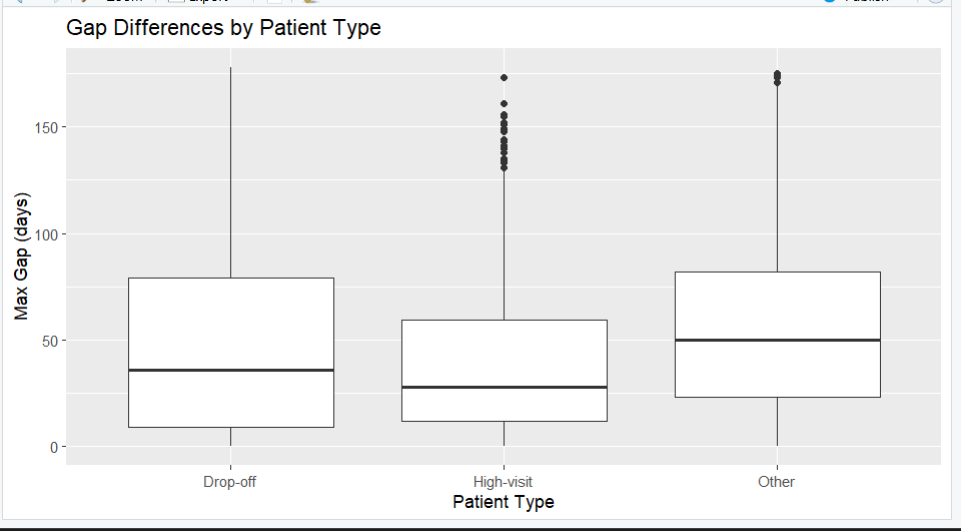

## 📊 Patient Engagement & Drop-off Analysis (DataFest 2026)

### 🔍 Overview  
This project analyzes patient journey data to understand why some patients consistently return for care while others disengage after only a few visits.  

Using a large-scale healthcare dataset (~7M+ records), this analysis identifies patterns in patient behavior and explores clinical and social factors influencing care continuity.

---

### Problem  
Patients interact with healthcare systems differently.  
Some maintain regular follow-ups, while others drop off after initial visits.  

This project aims to answer:  
**What drives differences in patient engagement?**

---

### Approach  

- Cleaned and processed large-scale encounter data using R  
- Constructed patient journeys using visit timelines  
- Calculated time gaps between visits  
- Segmented patients into behavioral groups  
- Integrated multiple datasets (encounters, diagnosis, social determinants)

---

### Key Findings  

#### 1. Patient Segmentation  
- **Drop-off patients** → 2 visits  
- **High-engagement patients** → more than 5 visits  

---

#### 2. Behavioral Patterns  
- Drop-off patients show **high variability** in visit gaps  
- Gaps range from short intervals to extreme delays (~178 days)  
- High-engagement patients exhibit **consistent visit patterns**

---

#### 3. Clinical Insights  
- Drop-off patients → routine / non-urgent care  
- High-engagement patients → chronic or ongoing conditions  

Engagement is strongly influenced by **clinical necessity**

---

#### 4. Social Determinants  
- Factors such as stress, financial strain, and transportation were analyzed  
- Differences between groups were **minimal**  

Social factors did not strongly explain drop-off behavior

---

### Key Insight  

> Patient engagement is driven more by the urgency of medical conditions than by social factors.

---

### Visualization  

> Drop-off patients exhibit more irregular visit patterns compared to high-engagement patients.

---

### Recommendations  

- Identify and flag patients at risk of dropping off  
- Implement proactive follow-up strategies (reminders, scheduling)  
- Improve patient awareness of the importance of continued care  

---

### Tools Used  

- R (dplyr, ggplot2)  
- Data cleaning & transformation  
- Exploratory Data Analysis (EDA)  
- Data visualization  

---

### My Contribution  

- Performed data cleaning and preprocessing on large-scale datasets  
- Developed patient segmentation (drop-off vs high-engagement)  
- Built visualizations and interpreted behavioral patterns  
- Analyzed clinical and social factors influencing patient engagement  
- Generated actionable recommendations based on data insights  

---

### Note  

Due to data privacy restrictions, the dataset is not included in this repository.
